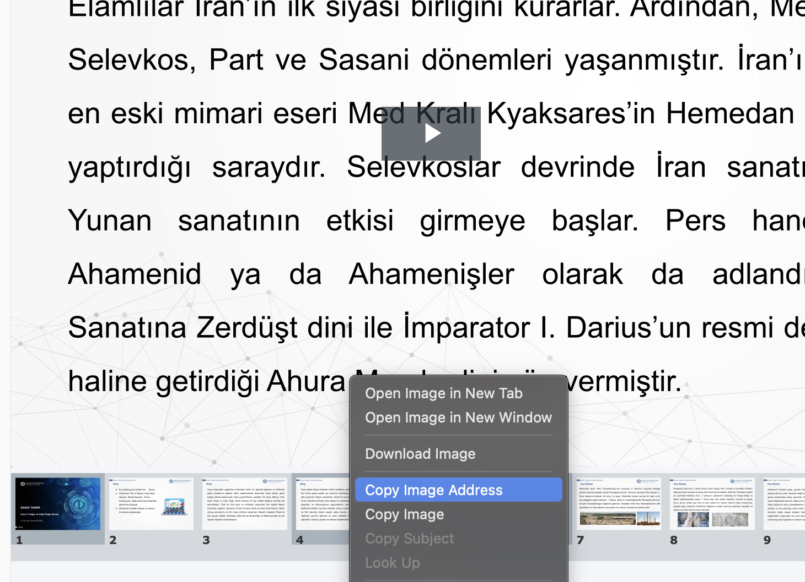

# Slide Downloader and Presentation Creator

This Python script downloads SVG slides from a specified URL, converts them to JPEG or PNG format, and creates a PowerPoint presentation.

## Setup Instructions

1. **Install Required Dependencies**

   First, ensure you have Python 3.6+ installed on your system. Then install the required packages:

   ```bash
   pip install -r requirements.txt
   ```

   Note: For CairoSVG to work properly, you may need to install additional system dependencies:
   
   - **On Ubuntu/Debian**:
     ```bash
     sudo apt-get install libcairo2-dev libpango1.0-dev libgdk-pixbuf2.0-dev libffi-dev shared-mime-info
     ```
   
   - **On macOS** (using Homebrew):
     ```bash
     brew install cairo pango gdk-pixbuf libffi
     ```
   
   - **On Windows**:
     It's recommended to use the pre-built binary wheels that pip will install automatically.

2. **Get the URL of the slide**
   
   Right-click on a slide in your browser and select "Copy Link Address" or "Copy Link" to get the URL of the slide.
   

3. **Run the Script**

   Use the script to download slides and create a presentation:

   ```bash
   python slide_downloader.py https://vkscalelite.anadolu.edu.tr/presentation/633fc11f5c4832a9db123d72eb67831a012d0710-1741272327834/presentation/091f41e4a0d9eaa5c28fad9596121aa1ed2b315c-1741272345267/svgs/slide1.svg
   ```

   The script will:
   - Download all slides (starting from slide1.svg)
   - Convert them to JPEG format
   - Create a PowerPoint presentation with all slides
   - Automatically delete the temporary image files

## Command-Line Options

```
usage: slide_downloader.py [-h] [--output-dir OUTPUT_DIR] [--start START] [--max MAX]
                          [--format {jpeg,png}] [--presentation PRESENTATION]
                          [--keep-images]
                          base_url

Download slides and create a presentation

positional arguments:
  base_url              Base URL for slides (e.g., https://example.com/presentation/id/svgs/slide)

optional arguments:
  -h, --help            show this help message and exit
  --output-dir OUTPUT_DIR
                        Directory to save the images (default: slides)
  --start START         Starting slide number (default: 1)
  --max MAX             Maximum number of slides to download (default: 100)
  --format {jpeg,png}   Output image format (default: jpeg)
  --presentation PRESENTATION
                        Output PowerPoint file (default: presentation.pptx)
  --keep-images         Keep the temporary image files after creating the presentation
```

## Examples

1. **Basic usage**:
   ```bash
   python slide_downloader.py https://vkscalelite.anadolu.edu.tr/presentation/633fc11f5c4832a9db123d72eb67831a012d0710-1741272327834/presentation/091f41e4a0d9eaa5c28fad9596121aa1ed2b315c-1741272345267/svgs/slide
   ```

2. **Specify range of slides**:
   ```bash
   python slide_downloader.py https://vkscalelite.anadolu.edu.tr/presentation/633fc11f5c4832a9db123d72eb67831a012d0710-1741272327834/presentation/091f41e4a0d9eaa5c28fad9596121aa1ed2b315c-1741272345267/svgs/slide --start 5 --max 20
   ```

3. **Use PNG format**:
   ```bash
   python slide_downloader.py https://vkscalelite.anadolu.edu.tr/presentation/633fc11f5c4832a9db123d72eb67831a012d0710-1741272327834/presentation/091f41e4a0d9eaa5c28fad9596121aa1ed2b315c-1741272345267/svgs/slide --format png
   ```

4. **Custom output location**:
   ```bash
   python slide_downloader.py https://vkscalelite.anadolu.edu.tr/presentation/633fc11f5c4832a9db123d72eb67831a012d0710-1741272327834/presentation/091f41e4a0d9eaa5c28fad9596121aa1ed2b315c-1741272345267/svgs/slide --output-dir my_slides --presentation my_lecture.pptx
   ```

5. **Keep temporary image files**:
   ```bash
   python slide_downloader.py https://vkscalelite.anadolu.edu.tr/presentation/633fc11f5c4832a9db123d72eb67831a012d0710-1741272327834/presentation/091f41e4a0d9eaa5c28fad9596121aa1ed2b315c-1741272345267/svgs/slide --keep-images
   ```

## Troubleshooting

1. **SVG Conversion Issues**:
   If CairoSVG fails to convert some slides, it might be due to malformed SVG content. Try downloading the SVGs separately and use a different converter.

2. **404 Errors**:
   The script will automatically stop after 3 consecutive 404 errors, assuming it has reached the end of available slides.

3. **Rate Limiting**:
   If you're getting connection errors, try increasing the delay between downloads by modifying the `time.sleep()` value in the script.