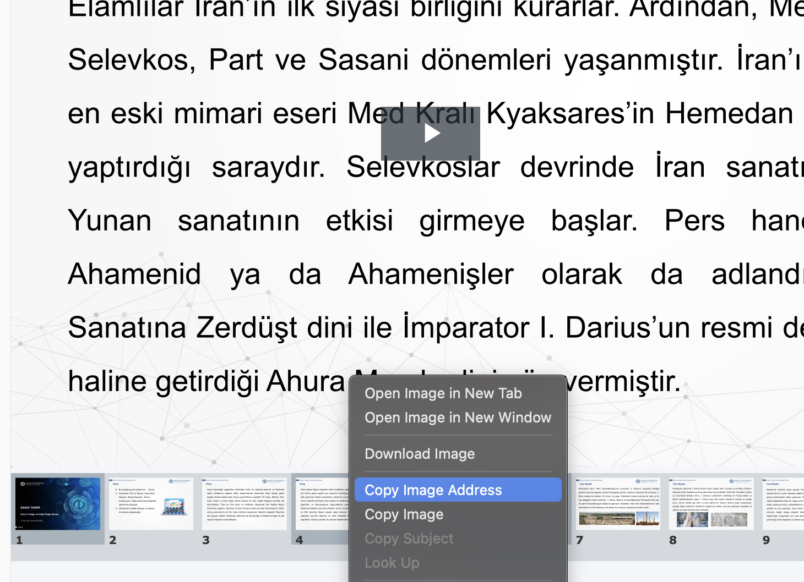

# Slayt İndirici ve Sunum Oluşturucu

Bu Python kodu, belirtilen bir URL'den SVG slaytlarını indirir, JPEG veya PNG formatına dönüştürür ve bir PowerPoint sunumu oluşturur.

## Kurulum Talimatları

1. **Gerekli Bağımlılıkları Yükleyin**

   Öncelikle, sisteminizde Python 3.6+ yüklü olduğundan emin olun. Ardından gerekli paketleri yükleyin:

   ```bash
   pip install -r requirements.txt
   ```

   Not: CairoSVG'nin düzgün çalışması için, ek sistem bağımlılıklarını yüklemeniz gerekebilir:
   
   - **Ubuntu/Debian'da**:
     ```bash
     sudo apt-get install libcairo2-dev libpango1.0-dev libgdk-pixbuf2.0-dev libffi-dev shared-mime-info
     ```
   
   - **macOS'ta** (Homebrew kullanarak):
     ```bash
     brew install cairo pango gdk-pixbuf libffi
     ```
   
   - **Windows'ta**:
     pip'in otomatik olarak yükleyeceği önceden derlenmiş ikili paketleri kullanmanız önerilir.

## 2. Slaytın URL'sini Alın

Tarayıcınızda bir slayta sağ tıklayın ve slaytın URL'sini almak için "Bağlantı Adresini Kopyala" veya "Bağlantıyı Kopyala" seçeneğini seçin.

<div align="center">
  
</div>

## 3. Kodu Çalıştırın

   Slaytları indirmek ve bir sunum oluşturmak için kodu kullanın:

   ```bash
   python slide_downloader.py https://vkscalelite.anadolu.edu.tr/presentation/633fc11f5c4832a9db123d72eb67831a012d0710-1741272327834/presentation/091f41e4a0d9eaa5c28fad9596121aa1ed2b315c-1741272345267/svgs/slide1.svg
   ```

   Kod şunları yapacaktır:
   - Tüm slaytları indirir (slide1.svg'den başlayarak)
   - Bunları JPEG formatına dönüştürür
   - Tüm slaytlarla bir PowerPoint sunumu oluşturur
   - Geçici görüntü dosyalarını otomatik olarak siler

## Komut Satırı Seçenekleri

```
Kullanım: slide_downloader.py [-h] [--output-dir OUTPUT_DIR] [--start START] [--max MAX]
                          [--format {jpeg,png}] [--presentation PRESENTATION]
                          [--keep-images]
                          base_url

Slaytları indirir ve bir sunum oluşturur

Zorunlu Değişkenler:
  base_url              Slaytlar için temel URL (örn., https://example.com/presentation/id/svgs/slide)

Opsiyonel Değişkenler:
  -h, --help                   Yardım mesajını göster ve çık
  --output-dir OUTPUT_DIR      Görüntülerin kaydedileceği dizin (varsayılan: slides)
  --start START                Başlangıç slayt numarası (varsayılan: 1)
  --max MAX                    İndirilecek maksimum slayt sayısı (varsayılan: 100)
  --format {jpeg,png}          Çıktı görüntü formatı (varsayılan: jpeg)
  --presentation PRESENTATION  Çıktı PowerPoint dosyası (varsayılan: presentation.pptx)
  --keep-images                Sunum oluşturulduktan sonra geçici görüntü dosyalarını sakla
```

## Örnekler

1. **Temel kullanım**:
   ```bash
   python slide_downloader.py https://vkscalelite.anadolu.edu.tr/presentation/633fc11f5c4832a9db123d72eb67831a012d0710-1741272327834/presentation/091f41e4a0d9eaa5c28fad9596121aa1ed2b315c-1741272345267/svgs/slide
   ```

2. **Slayt aralığını belirtme**:
   ```bash
   python slide_downloader.py https://vkscalelite.anadolu.edu.tr/presentation/633fc11f5c4832a9db123d72eb67831a012d0710-1741272327834/presentation/091f41e4a0d9eaa5c28fad9596121aa1ed2b315c-1741272345267/svgs/slide --start 5 --max 20
   ```

3. **PNG formatını kullanma**:
   ```bash
   python slide_downloader.py https://vkscalelite.anadolu.edu.tr/presentation/633fc11f5c4832a9db123d72eb67831a012d0710-1741272327834/presentation/091f41e4a0d9eaa5c28fad9596121aa1ed2b315c-1741272345267/svgs/slide --format png
   ```

4. **Özel çıktı konumu**:
   ```bash
   python slide_downloader.py https://vkscalelite.anadolu.edu.tr/presentation/633fc11f5c4832a9db123d72eb67831a012d0710-1741272327834/presentation/091f41e4a0d9eaa5c28fad9596121aa1ed2b315c-1741272345267/svgs/slide --output-dir slaytlarim --presentation dersim.pptx
   ```

5. **Geçici görüntü dosyalarını sakla**:
   ```bash
   python slide_downloader.py https://vkscalelite.anadolu.edu.tr/presentation/633fc11f5c4832a9db123d72eb67831a012d0710-1741272327834/presentation/091f41e4a0d9eaa5c28fad9596121aa1ed2b315c-1741272345267/svgs/slide --keep-images
   ```

## Sorun Giderme

1. **SVG Dönüştürme Sorunları**:
   CairoSVG bazı slaytları dönüştüremiyorsa, bu hatalı biçimlendirilmiş SVG içeriğinden kaynaklanıyor olabilir. SVG'leri ayrı ayrı indirmeyi ve farklı bir dönüştürücü kullanmayı deneyin.

2. **404 Hataları**:
   Kod, mevcut slaytların sonuna ulaştığını varsayarak 3 ardışık 404 hatasından sonra otomatik olarak duracaktır.

3. **Hız Sınırlaması**:
   Bağlantı hataları alıyorsanız, koddaki `time.sleep()` değerini değiştirerek indirmeler arasındaki gecikmeyi artırmayı deneyin.